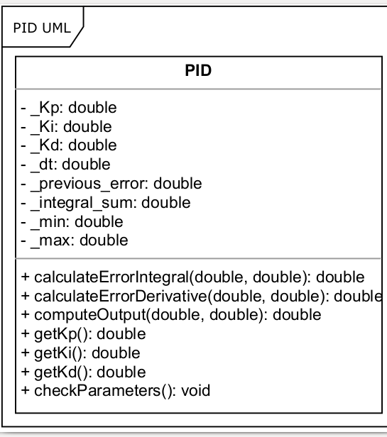

# PID Controller
[](https://app.travis-ci.com/siddharthtelang/PID-Controller)
[](https://coveralls.io/github/siddharthtelang/PID-Controller?branch=development)
[](https://opensource.org/licenses/MIT)
---

## Authors

Pair A:
- Siddharth Telang --driver
- Dani Lerner --navigator

Pair B:
- Rishabh Mukund --driver
- Maaruf Vazifdar --navigator

## Overview

An implementation of simple PID Controller including GTest, Travis CI, and
Coveralls.

## UML Diagram
<p align="center">

</p>

## Implementation instructions
### TODO
- complete calculateErrorIntegral
- complete calculateErrorDerivative
- complete computeOutput using the above and Kp, Ki, Kd values

### Tools used:

- cmake
- googletest
- Travis CI
- Coverals
- cpplint
- cppcheck

## Standard install via command-line
```
git clone --recursive https://github.com/siddharthtelang/PID-Controller.git
cd <path to repository>
mkdir build
cd build
cmake ..
make
Run tests: ./test/cpp-test
Run program: ./app/shell-app
```

## Building for code coverage
```
sudo apt-get install lcov
cmake -D COVERAGE=ON -D CMAKE_BUILD_TYPE=Debug ../
make
make code_coverage
```
This generates a index.html page in the build/coverage sub-directory that can be viewed locally in a web browser.

## Run cppcheck and cpplint
### Results are already stored in resilts/
```
cppcheck --enable=all --std=c++11 -I include/ --suppress=missingIncludeSystem $( find . -name *.cpp | grep -vE -e "^./build/" -e "^./vendor/")
cpplint $( find . -name *.cpp -or -name *.hpp | grep -vE -e "^./build/" -e "^./vendor/" )

```
## Doxygen folder
- doxygen_folder

## Working with Eclipse IDE ##

## Installation

In your Eclipse workspace directory (or create a new one), checkout the repo (and submodules)
```
mkdir -p ~/workspace
cd ~/workspace
git clone --recursive https://github.com/siddharthtelang/PID-Controller.git
```

In your work directory, use cmake to create an Eclipse project for an [out-of-source build] of cpp-boilerplate

```
cd ~/workspace
mkdir -p boilerplate-eclipse
cd boilerplate-eclipse
cmake -G "Eclipse CDT4 - Unix Makefiles" -D CMAKE_BUILD_TYPE=Debug -D CMAKE_ECLIPSE_VERSION=4.7.0 -D CMAKE_CXX_COMPILER_ARG1=-std=c++14 ../cpp-boilerplate/
```

## Import

Open Eclipse, go to File -> Import -> General -> Existing Projects into Workspace -> 
Select "boilerplate-eclipse" directory created previously as root directory -> Finish

# Edit

Source files may be edited under the "[Source Directory]" label in the Project Explorer.


## Build

To build the project, in Eclipse, unfold boilerplate-eclipse project in Project Explorer,
unfold Build Targets, double click on "all" to build all projects.

## Run

1. In Eclipse, right click on the boilerplate-eclipse in Project Explorer,
select Run As -> Local C/C++ Application

2. Choose the binaries to run (e.g. shell-app, cpp-test for unit testing)
